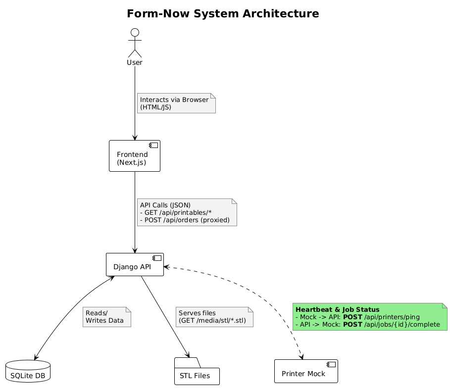

# Architecture

## Services:
- Frontend (Next.js) – user-facing shop and 3D previews
- Printer API (Django) – orders, printables, printer coordination
- Printer mock – simulates one or more printers talking to the API

## Architecture

## Data models

The system consists of three main data models that handle the 3D printing workflow:

### **Printable**
Represents 3D objects that can be printed.
- `name`: Display name (e.g., "Red Cube")
- `color`: Optional color specification for visual display
- `stl`: File reference to the STL 3D model file stored in `/media/stl/`

Example: The system is seeded with three demo printables (Red/Green/Blue Cube) that reference STL files.

### **Order**
Represents a customer order containing one or more printable items.
- `status`: Order lifecycle state - `unknown` → `queued` → `assigned` → `printing` → `complete`/`failed`
- `items`: JSON array of order items, each containing:
  - `printable_id`: Reference to a Printable
  - `qty`: Quantity to print
- `assigned_printer_id`: Which printer is handling this order (when assigned)
- `created_at`/`updated_at`: Timestamps for tracking

Order Flow:
1. Created via POST `/api/orders` with status `queued`
2. Assigned to an idle printer → status becomes `assigned`
3. Printer starts work → status becomes `printing`
4. Printer completes → status becomes `complete`

### **Printer**
Represents physical 3D printers that execute orders.
- `name`: Human-readable printer identifier
- `status`: Current printer state (`idle`, `printing`, etc.)
- `last_ping_at`: Heartbeat timestamp from printer health checks
- `current_order`: Reference to the Order currently being processed (if any)

Printer Lifecycle:
- Printers register themselves via POST `/api/printers/ping`
- API assigns queued orders to idle printers automatically
- Printers report completion via POST `/api/jobs/{id}/complete`
